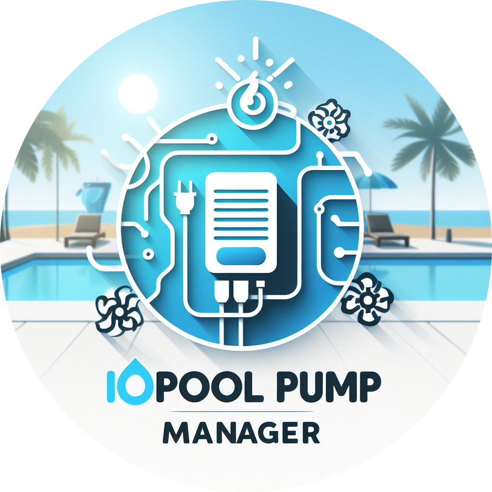

<p align="center">
  
</p>
<p align="center">
    <h1 align="center">AppDaemon - iopool Pump Manager</h1>
</p>
<p align="center">
    <em><code>Worry-free pool management with iopool</code></em>
</p>
<p align="center">
	
	
	
	
<p>
<p align="center">
    
    
    <a href="https://github.com/mguyard/appdaemon-iopoolpumpmanager/actions/workflows/lint.yaml" target="_blank">
        
    </a>
    <a href="https://github.com/mguyard/appdaemon-iopoolpumpmanager/actions/workflows/hacs_validate.yaml" target="_blank">
        
    </a>
<p>
<p align="center">
	<!-- default option, no dependency badges. -->
</p>
<hr>


> - [📍 Overview](#-overview)
> - [📦 Features](#-features)
> - [🚀 Getting Started](#-getting-started)
>   - [🔝 Requirements](#-requirements)
>   - [⚙️ Installation](#️-installation)
> - [🏷️ Configuration](#-configuration)
>   - [🤖 AppDaemon](#-appdaemon)
>   - [🖇️ AppDaemon dependencies](#-appdaemon-dependencies)
>   - [🛖 Home Assistant needed entities](#-home-assistant-needed-entities)
>   - [💦 iopool Pump Manager](#-iopool-pump-manager)
>   - [🧩 Parameters](#-parameters)
>   - [📨 Notifications](#-notifications)
>   - [📝 FAQ](#-faq)
> - [🪲 Debug](#-debug)
> - [🤝 Contributing](#-contributing)


## 📍 Overview

### Objective

The objective of the iopool Pump Manager project is to provide an easy-to-use solution for managing your pool pump based on filtration duration information from [iopool](https://iopool.com). The project aims to automate the process of switching the pool pump on and off, simplifying pool management tasks for the user.

> [!NOTE]
>
> Please note that the iopool Pump Manager project is currently under development. As an open-source project, users are encouraged to adapt it to their own needs and contribute to its evolution by [submitting pull requests]((#-contributing)).


### Motivation

This AppDaemon application was born out of the need to manage my pool pump as I used to do on Jeedom before migrating to Home Assistant.
The objective was simple: get iopool's filtration recommendations and manage my pool pump with this information to guarantee perfect, problem-free water.

## 📦 Features

iopool Pump Manager aims to provide an easy-to-use solution for managing your pool pump based on iopool filter time recommandations. The main features of the application are :

- Automation of the pool pump activation and deactivation process during summer but also during Active Winter filtration.
- Management of filtration tasks according to iopool recommendations.
- Management of tasks according to user-defined time slots (single or multiple).
- Management of custom boosts to follow recommandations after adding chemicals
- Notification event at the end of filtration day

## 🚀 Getting Started

### 🔝 Requirements

- A valid and functional deployment of [`AppDaemon Addon` connected to Home Assistant](https://community.home-assistant.io/t/home-assistant-community-add-on-appdaemon-4/163259)
- A valid and functional [`HACS` (Home Assistant Community Store) integration](https://hacs.xyz/docs/setup/download)

### ⚙️ Installation

- [Enable AppDaemon Apps in HACS](https://hacs.xyz/docs/categories/appdaemon_apps/)
- [Add Automation repository](https://my.home-assistant.io/redirect/hacs_repository/?owner=mguyard&repository=appdaemon-iopoolpumpmanager&category=appdaemon) in HACS as AppDaemon repo : https://github.com/mguyard/appdaemon-iopoolpumpmanager
- Install iopool Pump Manager in HACS
- [Install `Studio Code Server` addon](https://my.home-assistant.io/redirect/supervisor_store/) to edit your AppDaemon & iopoolPumpManager configuration (optional if your prefer another method to modify your configuration)

## 🏷️ Configuration

### 🤖 AppDaemon

Firstly you need to configure your newly AppDaemon installation.

> [!NOTE]
> 
> Please continue to next chapter if AppDaemon was already configured before this App

[AppDaemon Main configuration](https://appdaemon.readthedocs.io/en/latest/CONFIGURE.html#appdaemon) is available in file `appdaemon.yaml` most of the time stored in `/add_config/<guid>_appdaemon/`

Please find below an example of basic configuration (It may need to be adapted to suit your configuration) :

```yaml
---
secrets: /homeassistant/secrets.yaml
appdaemon:
  latitude: 48.80506979319244
  longitude: 2.12031248278925
  elevation: 130
  time_zone: Europe/Paris
  plugins:
    HASS:
      type: hass
http:
  url: http://127.0.0.1:5050
admin:
api:
hadashboard:

logs:
  main_log:
    filename: /config/logs/appdaemon.log
  error_log:
    filename: /config/logs/error.log
```

Add in logs part the log for iopool Pump Manager :

```yaml
logs:
    [...]
    iopoolPumpManager:
        name: iopoolPumpManager
        filename: /conf/logs/iopoolPumpManager.log
```

### 🖇️ AppDaemon dependencies

You need to add a python package to AppDaemon for this application to work.

To do this, go to your AppDaemon add-on configuration and add `pydantic` in the `package python` field.

> `pydantic` should appear as a tag above the `package python` field.

[](https://my.home-assistant.io/redirect/supervisor_addon/?addon=a0d7b954_appdaemon)

### 🛖 Home Assistant needed entities

Follow this [documentation](docs/HOMEASSISTANT.md)

### 💦 iopool Pump Manager

To configure iopool Pump Manager app you need to edit `apps.yaml` configuration most of the time stored in `/add_config/<guid>_appdaemon/apps/`

Please find below an complete example of configuration to add in file :

```yaml
iopoolPumpManager:
    module: iopool_pump_manager
    class: iopoolPumpManager
    use_dictionary_unpacking: true
    log: iopoolPumpManager
    config:
      pump_switch: switch.pool_switch
      filtration_mode: input_select.pool_mode
      filtration_summer:
        recommanded_duration: sensor.iopool_recommanded_filtration_duration
        elapsed_today: sensor.pool_elapsed_filtration_duration
        min_duration: 240
        max_duration: 480
        slots:
          slot1:
            name: "Morning filtration"
            start: 11:00:00
            duration_percent: 25
          slot2:
            name: "Hot hours Filtrations"
            start: 14:30:00
            duration_percent: 75
      filtration_winter:
        name: "Winter filtration"
        duration: 01:30:00
        start: 02:00:00
      boost:
        selector: input_select.pool_boost_selector
        timer: timer.pool_boost
```

All configuration parameters are detailled in next chapter [🧩 Parameters](#-parameters)

### 🧩 Parameters

__Please find below all configuration parameters who don't apply to slots directly__

| Parent            | Parameters           | Description                                                                                                                                                                       | Configuration Path                            | Default | Type                         | Status    |
|-------------------|----------------------|-----------------------------------------------------------------------------------------------------------------------------------------------------------------------------------|-----------------------------------------------|---------|------------------------------|-----------|
| -                 | dryrun               | Enable a dryrun mode that don't execute open or close functions                                                                                                                   | config.dryrun                                 | False   | Boolean                      | Optional  |
| -                 | pump_switch          | Switch entity of your pump                                                                                                                                                        | config.pump_switch                            |         | Switch Entity                | Required  |
| -                 | filtration_mode      | Input Select Entity with these options: Standard, Active-Winter, Passive-Winter                                                                                                   | config.filtration_mode                        |         | Input_select Entity          | Required  |
| filtration_summer | recommanded_duration | Sensor coming from iopool API providing a recommanded filtration duration                                                                                                         | config.filtration_summer.recommanded_duration |         | Sensor Entity                | Required  |
| filtration_summer | elapsed_today        | History_stats Sensor Entity providing how many hours pump has run today                                                                                                           | config.filtration_summer.elapsed_today        |         | Sensor Entity                | Required  |
| filtration_summer | min_duration         | How many time at least you want your pump run each days                                                                                                                           | config.filtration_summer.min_duration         | None    | PositiveInt                  | Optional  |
| filtration_summer | max_duration         | How many time at maximum you want your pump run each days                                                                                                                         | config.filtration_summer.max_duration         | None    | PositiveInt (less than 1440) | Optional  |
| filtration_summer | slots                | List of all slots you want to manage. See table below to know each allowed parameters                                                                                             | config.filtration_summer.slots                |         | Dictionnary                  | Required  |
| filtration_winter | name                 | Name of Active-Winter slot  (when your pool is define as Active-Winter mode in filtration_mode entity)                                                                            | config.filtration_winter.name                 | None    | String                       | Optional  |
| filtration_winter | duration             | Duration of Active-Winter slot (when your pool is define as Active-Winter mode in filtration_mode entity)                                                                         | config.filtration_winter.duration             | None    | TimeDelta                    | Optional  |
| filtration_winter | start                | Start time of Active-Winter slot  (when your pool is define as Active-Winter mode in filtration_mode entity)                                                                      | config.filtration_winter.start                | None    | Time                         | Optional  |
| boost             | selector             | Boost selector. At least "None" or "Aucun" is required with at least a time boost. Time boost need to be in <number>H format (please look iopool integration chapter for example) | config.boost.selector                         | None    | Select Entity                | Optional  |
| boost             | timer                | Timer entity who set the remaining time of in-progress boost                                                                                                                      | config.boost.timer                            | None    | Timer Entity                 | Optional  |


> [!TIP]
> 
> You can create multiple slots but sum of all slots duration_percent need to be equal to 100%

__Parameters for slots are below :__

| Parent                                 | Parameters       | Description                                                                                                                                                               | Configuration Path                                      | Default | Type                      | Status    |
|----------------------------------------|------------------|---------------------------------------------------------------------------------------------------------------------------------------------------------------------------|---------------------------------------------------------|---------|---------------------------|-----------|
| config.filtration_summer.slots.slot<X> | name             | Name of Standard slot  (when your pool is define as Standard mode in filtration_mode entity)                                                                              | config.filtration_summer.slots.slot<X>.name             | None    | String                    | Optional  |
| config.filtration_summer.slots.slot<X> | start            | Start time of Standard slot  (when your pool is define as Standard mode in filtration_mode entity)                                                                        | config.filtration_summer.slots.slot<X>.start            |         | Time                      | Required  |
| config.filtration_summer.slots.slot<X> | duration_percent | Percentage of calculated filtration time (based on iopool recommandation and your min and max duration defined) for this slot. All percent slots need to be equal to 100% | config.filtration_summer.slots.slot<X>.duration_percent |         | Postive Integer (1 - 100) | Required  |

> [!NOTE]
> 
> Saving configuration reload automatically application and apply your need configuration.
>
> First time you run application in `Standard` mode, a new entity is create in your Home Assistant to store the calculated filtration duration : `sensor.pool_pump_calculated_duration`.
> Calculated filtration duration is based on your iopool filtration recommandation and the min_duration and max_duration if configured.

### Notifications

At the end of each boost or at the end of the last daily filtration slot, an __event is sent to Home Assistant__ with name `iopoolpumpmanager_event`.
Two type of event exists :
- end_filtration
- end_boost

Please find below an example of each event received by Home Assistant :

```yaml
event_type: iopoolpumpmanager_event
data:
  type: end_filtration
  event_data:
    elapsed_min: 90
    required_min: 1
    end_at: "2024-05-25T11:42:00.024485+02:00"
    boost_in_progress: false
origin: REMOTE
time_fired: "2024-05-25T09:42:00.026367+00:00"
context:
  id: 01HYQJ1SJTRKWSM4XHQCCVQN7H
  parent_id: null
  user_id: 431c4fce7a8b41e48f266d7c61f0a8f7
```

```yaml
event_type: iopoolpumpmanager_event
data:
  type: end_boost
  event_data:
    boost: 1H
    started_at: "2024-05-25T10:09:57.012354"
    ended_at: "2024-05-25T11:09:57.013586"
origin: REMOTE
time_fired: "2024-05-25T09:09:57.019022+00:00"
context:
  id: 01HYQG73MVZB8E7TC8FSWK5BAN
  parent_id: null
  user_id: 431c4fce7a8b41e48f266d7c61f0a8f7
```

Based on that, you can create some automations to exploit these events like to push a notification.

### FAQ

<details closed>
    <summary>The iopool filtration recommendation may change during the day depending on the temperature. What happens if 2 slots overlap ?</summary>  

_If two slots overlap because the percentage of time allocated to one slot is greater than the time between start-ups, the previous slot will not stop at the scheduled time to avoid unwanted pump stoppage.
This means that the filtration time will be shorter than expected. For this reason, when using multiple slots, we recommend leaving sufficient time between slots as a precaution._
</details>

***

<details closed>
    <summary>If my pump has stopped during the day (for maintenance, for example), in the case of the overlapping time slots explained above, or the change in the iopool recommendation during the day, would I not have filtered enough during the day ?</summary>  

_To manage this case, when the last slot is started, the application will calculate not the percentage of time defined in the configuration based on the calculated filtration time (iopool recommendation with min_duration and max_duration), but the remaining filtration time based on the filtration time calculated when the last slot was started._

This ensures that all recommended filtration times are applied.
</details>

## 🪲 Debug

To help to debug and understand an issue, you can enable the debug mode in app.
For this, edit the app configuration and set `log_level` to DEBUG

```yaml
iopoolPumpManager:
    [...]
    log: iopoolPumpManager
    log_level: DEBUG    <---- HERE
    config:
        [...]
```

If you need some assistance, you can open a topic in [Discussions](https://github.com/mguyard/appdaemon-iopoolpumpmanager/discussions) or by [opening an Issue](https://github.com/mguyard/appdaemon-iopoolpumpmanager/issues/new?assignees=&labels=Bug&projects=&template=bug_report.yml)

## 🤝 Contributing

Contributions are welcome! Here are several ways you can contribute:

- **[Submit Pull Requests](https://github.com/mguyard/appdaemon-iopoolpumpmanager/pulls)**: Review open PRs, and submit your own PRs.
- **[Report Issues](https://github.com/mguyard/appdaemon-iopoolpumpmanager/issues/new?assignees=&labels=Bug&projects=&template=bug_report.yml)**: Submit bugs found or log feature requests.

<details closed>
    <summary>Contributing Guidelines</summary>

1. **Fork the Repository**: Start by forking the project repository to your GitHub account.
2. **Clone Locally**: Clone the forked repository to your local machine using a Git client.
   ```sh
   git clone https://github.com/mguyard/appdaemon-iopoolpumpmanager
   ```
3. **Create a New Branch**: Always work on a new branch, giving it a descriptive name.
   ```sh
   git checkout -b new-feature-x
   ```
4. **Make Your Changes**: Develop and test your changes locally.
5. **Commit Your Changes**: Commit with a clear message describing your updates.
   ```sh
   git commit -m 'Implemented new feature x.'
   ```
6. **Push to GitHub**: Push the changes to your forked repository.
   ```sh
   git push origin new-feature-x
   ```
7. **Submit a Pull Request**: Create a PR against the original project repository. Clearly describe the changes and their motivations.

Once your PR is reviewed and approved, it will be merged into the dev branch.

</details>


> [!WARNING]
>
> Only PR to `dev` branch will be accepted.
