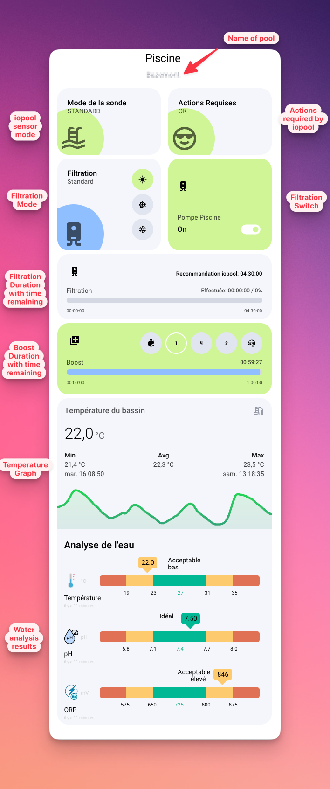

# Retrieving information from Home Assistant

> [!NOTE]
>
> We're going to use several types of entities that we'll retrieve via RESTful Sensor.
> For simplicity's sake, we're going to declare them in a Home Assistant package.

_Home Assistant can only retrieve information provided by the iopool cloud. This means that if the data is not correct or up to date on the iopool mobile app, the data will not be good in Home Assistant._

## Retrieve your iopool API key

To do this, go to your iopool application and :

- Select the More menu (bottom right)
- Go to Settings
- Retrieve your API key

## Declaration of Home Assistant packages

Open your Home Assistant `configuration.yaml` with the editor you usually use (like Studio Code Server addon).

Add a configuration package in the `homeassistant:` section, as shown below:

```yaml
homeassistant:
  # Load packages
  packages: !include_dir_merge_named includes/packages
```

If you already have a reference of this type in your configuration and understand it, you can skip to the next chapter (_but keep the associated directory in mind_).

In this example, __packages will be different files__ in the `includes/packages` directory. If this directory don't exist, please create it.

Regarding the use of !include_dir_merge_named, I invite you to [learn more here](https://www.home-assistant.io/docs/configuration/splitting_configuration#advanced-usage).

## Declare your API key in secrets.yaml

Open your `secrets.yaml` with your usual editor.

Add the reference to your previously retrieved iopool key:

```yaml
# iopool
iopool_api_key: icimacléapiiopool
```

> [!NOTE]
>
> Adding your API key to secrets.yaml is not mandatory, but is recommended if you want to share YAML code with confidence.
> The rest of this tutorial assumes that you are using secrets.yaml. If you're not, you'll need to adapt your configuration in the next chapter.

## Retrieving your pool ID

You need to know your pool ID in order to query the iopool API.

Unfortunately, this ID is not visible on the mobile application interface, but it can be easily retrieved.

To do so, simply run one of the following commands, depending on your operating system:

### For Unix/Linux (can also works on some Windows)

```bash
curl --header 'x-api-key: icimacléapiiopool' https://api.iopool.com/v1/pools/
```

### For Windows

```powershell
$headers=@{}
$headers.Add("x-api-key", "icimacléapiiopool")
$response = Invoke-WebRequest -Uri 'https://api.iopool.com/v1/pools/' -Method GET -Headers $headers
```

> [!WARNING]
>
> Be sure to change icimacléapiiopool to your real API key, retrieved in the previous steps.

The answer will be something like this:

```json
[
  {
    "id": "1aaa22b3-ccc4-4567-d888-e999ff000000",
    "title": "Your Pool Name",
    "latestMeasure": {
      "temperature": 23.129907809491385,
      "ph": 7.422857142857143,
      "orp": 660,
      "mode": "standard",
      "isValid": true,
      "ecoId": "/Keb7cMf",
      "measuredAt": "2024-05-24T14:04:00.000Z"
    },
    "mode": "STANDARD",
    "hasAnActionRequired": false,
    "advice": {
      "filtrationDuration": 4
    }
  }
]
```

The content of the id field is your basin identifier. If you have several probes, you'll see the above example several times, so you'll need to choose the right identifier.

## Declaration of your iopool package

Create an `iopool.yaml` file in the `includes/packages` folder

> [!WARNING]
>
> We assume that you have declared the folder for your packages as defined in the "Home Assistant package declaration" paragraph.
> If not, please adjust the folder in which to create the file

This file will contain all the entities to be created, regardless of their type.
Let's start by detailing the elements, and you'll find the complete file at the end of this chapter.

```yaml
iopool:
  sensor:
    - platform: rest
      unique_id: fabc1ee2-0bbe-416e-b23d-2474ac25fe4e
      name: iopool
      resource: https://api.iopool.com/v1/pool/<your pool id>
      value_template: "{{ value_json.title }}"
      json_attributes:
        - id
        - latestMeasure
        - hasAnActionRequired
        - advice
        - mode
      headers:
        x-api-key: !secret iopool_api_key
      scan_interval: 300
      icon: mdi:pool
```

The first line `iopool:` is used to declare the package name. This is necessary because we use `include_dir_merge_named` in our package directory declaration.
Next, we declare a sensor that will be fed by the Rest platform that enables Home Assistant to make API requests.

The sensor will be named `sensor.iopool` and its state will be the name of your pool. Data will be refreshed every 5 minutes (300 seconds).

It will also contain several attributes that serve as data storage. I won't go into detail here, as these attributes are of little importance at this stage.

> [!WARNING]
>
> Take attention to replace in `resource:` the end of URL with your pool id.

***

Now that we've created the entity able to retrieve information from the iopool API, we need to create entities to store each piece of information separately, so that we can more easily exploit it later.

```yaml
template:
    - sensor:
        - name: "temperature_iopool_pool"
          unique_id: b336b008-dc88-4e3b-afd9-d662979fb0c1$
          state: "{{ state_attr('sensor.iopool', 'latestMeasure')['temperature'] | round(2) }}"
          device_class: temperature
          unit_of_measurement: "°C"
          state_class: measurement
          icon: mdi:pool-thermometer
          attributes:
            source: "{{ state_attr('sensor.iopool', 'latestMeasure')['mode'] }}"
            isValid: "{{ state_attr('sensor.iopool', 'latestMeasure')['isValid'] }}"
            measuredAt: "{{ state_attr('sensor.iopool', 'latestMeasure')['measuredAt'] }}"
            
        - name: "ph_iopool_pool"
          unique_id: f4804a67-1224-4507-a4fb-21d983958b7c
          state: "{{ state_attr('sensor.iopool', 'latestMeasure')['ph'] | round(1) }}"
          unit_of_measurement: "pH"
          attributes:
            source: "{{ state_attr('sensor.iopool', 'latestMeasure')['mode'] }}"
            isValid: "{{ state_attr('sensor.iopool', 'latestMeasure')['isValid'] }}"
            measuredAt: "{{ state_attr('sensor.iopool', 'latestMeasure')['measuredAt'] }}"
            
        - name: "orp_iopool_pool"
          unique_id: e0ef9122-c53a-41ae-be72-517f3fcbb443
          state: "{{ state_attr('sensor.iopool', 'latestMeasure')['orp'] | round(0) }}"
          unit_of_measurement: "mV"
          attributes:
            source: "{{ state_attr('sensor.iopool', 'latestMeasure')['mode'] }}"
            isValid: "{{ state_attr('sensor.iopool', 'latestMeasure')['isValid'] }}"
            measuredAt: "{{ state_attr('sensor.iopool', 'latestMeasure')['measuredAt'] }}"
            
        - name: "recommanded_filtration_iopool_pool"
          unique_id: f53659ba-922f-4861-9198-73a7dd43ae6a
          state: "{{ state_attr('sensor.iopool', 'advice')['filtrationDuration'] * 60 }}"
          device_class: duration
          unit_of_measurement: "min"
          icon: mdi:sun-clock-outline
          
        - name: "mode_iopool_pool"
          unique_id: af6db587-be33-44e7-950c-fa52f0453d1f
          state: "{{ state_attr('sensor.iopool', 'mode') }}"
          icon: mdi:auto-mode

    - binary_sensor:
        - name: "required_actions_iopool_pool"
          unique_id: fb6bb7e0-86ad-4f27-90ee-47c39db0ab12
          state: "{{ state_attr('sensor.iopool', 'hasAnActionRequired') }}"
          device_class: problem
          icon: mdi:checkbox-marked-circle-plus-outline
```

> [!WARNING]
>
> Our `template:` must be at the same indentation level as the `sensor` we declared earlier. If in doubt, please refer to the full version of the file at the end of this chapter.

As you can see, we use a template to collect the information presented in sensor.iopool and distribute it to different sensor and binary_sensor entities:

- sensor.temperature_iopool_pool
- sensor.ph_iopool_pool
- sensor.orp_iopool_pool
- sensor.recommanded_filtration_iopool_pool
- sensor.mode_iopool_pool
- binary_sensor.required_actions_iopool_pool

__You can now verify and restart your Home Assistant configuration.__

[](https://my.home-assistant.io/redirect/server_controls/)

As each entity has a unique_id, you can modify the entity name via the Home Assistant web interface to make it more comprehensible. I suggest the following names:

- Pool temperature
- pH pool
- Disinfection capacity
- Pool Recommanded Filtration Duration
- Pool mode
- Pool Actions required

## Full configuration file

```yaml
iopool:
  sensor:
    - platform: rest
      unique_id: fabc1ee2-0bbe-416e-b23d-2474ac25fe4e
      name: iopool
      resource: https://api.iopool.com/v1/pool/<your_pool_id>
      value_template: "{{ value_json.title }}"
      json_attributes:
        - id
        - latestMeasure
        - hasAnActionRequired
        - advice
        - mode
      headers:
        x-api-key: !secret iopool_api_key
      scan_interval: 300
      icon: mdi:pool

      
  template:
    - sensor:
        - name: "temperature_iopool_pool"
          unique_id: b336b008-dc88-4e3b-afd9-d662979fb0c1$
          state: "{{ state_attr('sensor.iopool', 'latestMeasure')['temperature'] | round(2) }}"
          device_class: temperature
          unit_of_measurement: "°C"
          state_class: measurement
          icon: mdi:pool-thermometer
          attributes:
            source: "{{ state_attr('sensor.iopool', 'latestMeasure')['mode'] }}"
            isValid: "{{ state_attr('sensor.iopool', 'latestMeasure')['isValid'] }}"
            measuredAt: "{{ state_attr('sensor.iopool', 'latestMeasure')['measuredAt'] }}"
            
        - name: "ph_iopool_pool"
          unique_id: f4804a67-1224-4507-a4fb-21d983958b7c
          state: "{{ state_attr('sensor.iopool', 'latestMeasure')['ph'] | round(1) }}"
          unit_of_measurement: "pH"
          attributes:
            source: "{{ state_attr('sensor.iopool', 'latestMeasure')['mode'] }}"
            isValid: "{{ state_attr('sensor.iopool', 'latestMeasure')['isValid'] }}"
            measuredAt: "{{ state_attr('sensor.iopool', 'latestMeasure')['measuredAt'] }}"
            
        - name: "orp_iopool_pool"
          unique_id: e0ef9122-c53a-41ae-be72-517f3fcbb443
          state: "{{ state_attr('sensor.iopool', 'latestMeasure')['orp'] | round(0) }}"
          unit_of_measurement: "mV"
          attributes:
            source: "{{ state_attr('sensor.iopool', 'latestMeasure')['mode'] }}"
            isValid: "{{ state_attr('sensor.iopool', 'latestMeasure')['isValid'] }}"
            measuredAt: "{{ state_attr('sensor.iopool', 'latestMeasure')['measuredAt'] }}"
            
        - name: "recommanded_filtration_iopool_pool"
          unique_id: f53659ba-922f-4861-9198-73a7dd43ae6a
          state: "{{ state_attr('sensor.iopool', 'advice')['filtrationDuration'] * 60 }}"
          device_class: duration
          unit_of_measurement: "min"
          icon: mdi:sun-clock-outline
          
        - name: "mode_iopool_pool"
          unique_id: af6db587-be33-44e7-950c-fa52f0453d1f
          state: "{{ state_attr('sensor.iopool', 'mode') }}"
          icon: mdi:auto-mode

    - binary_sensor:
        - name: "required_actions_iopool_pool"
          unique_id: fb6bb7e0-86ad-4f27-90ee-47c39db0ab12
          state: "{{ state_attr('sensor.iopool', 'hasAnActionRequired') }}"
          device_class: problem
          icon: mdi:checkbox-marked-circle-plus-outline
```

# Dashboard example

Here's an example of a map showing the status of your pool using iopool data:

```yaml
type: vertical-stack
cards:
  - type: custom:mushroom-title-card
    title: Piscine
    subtitle: '{{ states(''sensor.iopool'') }}'
    alignment: center
    title_tap_action:
      action: none
    subtitle_tap_action:
      action: none
  - type: grid
    square: false
    cards:
      - type: custom:button-card
        name: Mode de la sonde
        icon: mdi:pool
        entity: sensor.mode_iopool_pool
        show_state: true
        state:
          - operator: '=='
            value: STANDARD
            styles:
              img_cell:
                - background: var(--green)
          - operator: regex
            value: (ACTIVE_)?WINTER
            icon: mdi:snowflake
            styles:
              img_cell:
                - background: var(--blue-tint)
        styles:
          grid:
            - grid-template-areas: '"n btn" "s btn" "i btn"'
            - grid-template-columns: 1fr min-content
            - grid-template-rows: min-content min-content 1fr
          img_cell:
            - justify-content: start
            - position: absolute
            - width: 130px
            - height: 130px
            - left: 0
            - bottom: 0
            - margin: 0 0 -30px -30px
            - background: var(--blue)
            - border-radius: 200px
          icon:
            - width: 60px
            - left: 35px
            - color: contrast20
            - opacity: '0.6'
          card:
            - height: 100%
            - padding: 22px 8px 22px 22px
          name:
            - justify-self: start
            - align-self: start
            - font-size: 16px
            - font-weight: 500
            - color: contrast20
          state:
            - min-height: 80px
            - justify-self: start
            - align-self: start
            - font-size: 14px
            - opacity: '0.7'
      - type: custom:button-card
        name: Actions Requises
        icon: mdi:emoticon-cool-outline
        entity: binary_sensor.required_actions_iopool_pool
        show_state: true
        state:
          - value: 'off'
            styles:
              img_cell:
                - background: var(--green)
          - value: 'on'
            icon: mdi:exclamation
            styles:
              img_cell:
                - background: var(--red)
        styles:
          grid:
            - grid-template-areas: '"n btn" "s btn" "i btn"'
            - grid-template-columns: 1fr min-content
            - grid-template-rows: min-content min-content 1fr
          img_cell:
            - justify-content: start
            - position: absolute
            - width: 130px
            - height: 130px
            - left: 0
            - bottom: 0
            - margin: 0 0 -30px -30px
            - background: var(--blue)
            - border-radius: 200px
          icon:
            - width: 60px
            - left: 35px
            - color: contrast20
            - opacity: '0.6'
          card:
            - height: 100%
            - padding: 22px 8px 22px 22px
          name:
            - justify-self: start
            - align-self: start
            - font-size: 16px
            - font-weight: 500
            - color: contrast20
          state:
            - min-height: 80px
            - justify-self: start
            - align-self: start
            - font-size: 14px
            - opacity: '0.7'
    columns: 2
  - type: grid
    square: false
    cards:
      - type: custom:button-card
        name: Filtration
        icon: mdi:water-boiler
        entity: input_select.pool_mode
        show_state: true
        custom_fields:
          btn:
            card:
              type: custom:mushroom-chips-card
              chips:
                - type: template
                  tap_action:
                    action: call-service
                    service: input_select.select_option
                    target:
                      entity_id: input_select.pool_mode
                    data:
                      option: Standard
                  hold_action:
                    action: none
                  double_tap_action:
                    action: none
                  icon: mdi:white-balance-sunny
                  entity: input_select.pool_mode
                  card_mod:
                    style: |
                      ha-card {
                        --chip-background: {{ 'var(--green)' if is_state('input_select.pool_mode', 'Standard') else 'var(--contrast4)' }};
                        padding: 5px!important;
                        border-radius: 100px!important;
                      }
                      ha-card::after {
                        content: "Standard";
                        position: absolute;
                        bottom: 10%;
                        left: 10%;
                        transform: translateX(-100%);
                        background-color: var(--contrast1);
                        color: var(--contrast10);
                        font-size: 14px;
                        padding: 5px;
                        border-radius: 3px;
                        white-space: nowrap;
                        display: none;
                      }
                      ha-card:hover::after {
                        display: block;
                      }
                - type: template
                  tap_action:
                    action: call-service
                    service: input_select.select_option
                    target:
                      entity_id: input_select.pool_mode
                    data:
                      option: Active-Winter
                  hold_action:
                    action: none
                  double_tap_action:
                    action: none
                  icon: mdi:sun-snowflake
                  entity: input_select.pool_mode
                  card_mod:
                    style: |
                      ha-card {
                        --chip-background: {{ 'var(--green)' if is_state('input_select.pool_mode', 'Active-Winter') else 'var(--contrast4)' }};
                        padding: 5px!important;
                        border-radius: 100px!important;
                      }
                      ha-card::after {
                        content: "Active-Winter";
                        position: absolute;
                        bottom: 10%;
                        left: 10%;
                        transform: translateX(-100%);
                        background-color: var(--contrast1);
                        color: var(--contrast10);
                        font-size: 14px;
                        padding: 5px;
                        border-radius: 3px;
                        white-space: nowrap;
                        display: none;
                      }
                      ha-card:hover::after {
                        display: block;
                      }
                - type: template
                  tap_action:
                    action: call-service
                    service: input_select.select_option
                    target:
                      entity_id: input_select.pool_mode
                    data:
                      option: Passive-Winter
                  hold_action:
                    action: none
                  double_tap_action:
                    action: none
                  icon: mdi:snowflake
                  entity: input_select.pool_mode
                  card_mod:
                    style: |
                      ha-card {
                        --chip-background: {{ 'var(--green)' if is_state('input_select.pool_mode', 'Passive-Winter') else 'var(--contrast4)' }};
                        padding: 5px!important;
                        border-radius: 100px!important;
                      }
                      ha-card::after {
                        content: "Passive-Winter";
                        position: absolute;
                        bottom: 10%;
                        left: 10%;
                        transform: translateX(-100%);
                        background-color: var(--contrast1);
                        color: var(--contrast10);
                        font-size: 14px;
                        padding: 5px;
                        border-radius: 3px;
                        white-space: nowrap;
                        display: none;
                      }
                      ha-card:hover::after {
                        display: block;
                      }
        styles:
          grid:
            - grid-template-areas: '"n btn" "s btn" "i btn"'
            - grid-template-columns: 1fr min-content
            - grid-template-rows: min-content min-content 1fr
          img_cell:
            - justify-content: start
            - position: absolute
            - width: 130px
            - height: 130px
            - left: 0
            - bottom: 0
            - margin: 0 0 -30px -30px
            - background: var(--blue)
            - border-radius: 200px
          icon:
            - width: 60px
            - color: black
            - opacity: '0.6'
          card:
            - padding: 22px 8px 22px 22px
          name:
            - justify-self: start
            - align-self: start
            - font-size: 16px
            - font-weight: 500
            - color: contrast20
          state:
            - min-height: 80px
            - justify-self: start
            - align-self: start
            - font-size: 14px
            - opacity: '0.7'
          custom_field:
            btn:
              - justify-content: end
              - align-self: start
      - type: custom:button-card
        entity: switch.pool_switch
        name: Pompe Piscine
        icon: mdi:water-boiler
        tap_action:
          action: toggle
        state:
          - value: 'off'
            icon: mdi:water-boiler-off
            styles:
              card:
                - background: var(--red)
              icon:
                - color: var(--contrast1)
              name:
                - color: var(--contrast1)
              custom_fields:
                state:
                  - color: var(--contrast1)
        styles:
          grid:
            - grid-template-areas: '"i i" "n n" "state icon"'
            - grid-template-columns: 1fr 1fr
            - grid-template-rows: 1fr min-content min-content
          card:
            - padding: 20px
            - background: var(--green)
            - height: 100%
          name:
            - justify-self: start
            - font-size: 14px
            - color: var(--black1)
            - opacity: '0.7'
            - padding: 2px 0px
          icon:
            - width: 24px
            - color: var(--black1)
          img_cell:
            - justify-self: start
            - width: 24px
            - height: 24px
            - padding-bottom: 18px
          custom_fields:
            icon:
              - justify-self: end
              - margin-top: '-9px'
            state:
              - justify-self: start
              - font-size: 16px
              - font-weight: 500
              - margin-top: '-9px'
              - color: var(--black1)
        custom_fields:
          icon: |
            [[[
              var state = entity.state;
              if (state == "on")
                return '<ha-icon icon="mdi:toggle-switch" style="color: var(--contrast1); width: 50px; height: 50px">'
              else
                return '<ha-icon icon="mdi:toggle-switch-off" style="color: var(--contrast1); width: 50px; height: 50px">'
            ]]]
          state: |
            [[[
              var state = entity.state;
              if(state == "on")
                return `On`
              else
                return 'Off'
            ]]]
    columns: 2
  - type: custom:button-card
    entity: sensor.pool_elapsed_filtration_duration
    name: Filtration
    icon: mdi:water-boiler
    action: more-info
    styles:
      card:
        - padding: 20px
        - height: 140px
      grid:
        - grid-template-areas: '"i recommanded" "n stat2" "bar bar" "stat1 stat3"'
        - grid-template-columns: 1fr 1fr
        - grid-template-rows: 50px min-content 30px min-content
      name:
        - justify-self: start
        - font-size: 14px
        - opacity: 0.7
      icon:
        - width: 24px
      img_cell:
        - justify-self: start
        - align-self: start
        - width: 34px
        - height: 34px
      custom_fields:
        recommanded:
          - justify-self: end
          - align-self: center
          - padding-bottom: 6px
          - font-size: 12px
          - font-weight: 500
        stat1:
          - justify-self: start
          - font-size: 10px
          - opacity: 0.7
        stat2:
          - justify-self: end
          - font-size: 12px
          - opacity: 0.7
          - font-weight: 500
        stat3:
          - justify-self: end
          - font-size: 10px
          - opacity: 0.7
        bar:
          - justify-self: start
          - margin-top: '-4px'
          - width: 100%
          - border-radius: 6px
          - background: var(--contrast5)
          - height: 12px
    custom_fields:
      recommanded: |
        [[[
          var iopool_recommanded = states['sensor.recommanded_filtration_iopool_pool'].state;
          return "Recommandation iopool: " + new Date(iopool_recommanded * 60 * 1000).toISOString().substr(11, 8);
        ]]]
      bar: |
        [[[
          var duration = states['sensor.pool_pump_calculated_duration'].state;
          var elapsed = Math.round(entity.state * 60, 2);
          var elapsed_percent = Math.round(Math.min(100,((elapsed/duration)*100)),2);
          return `<div> <div style="background: var(--blue); height: 12px; width: ${elapsed_percent}%"></div> </div>`
        ]]]
      stat1: '00:00:00'
      stat2: |
        [[[
          var duration = states['sensor.pool_pump_calculated_duration'].state;
          var elapsed = Math.round(entity.state * 60, 2);
          var elapsed_percent = Math.round(((elapsed/duration)*100),2);
          return "Effectuée: " + new Date(elapsed * 60 * 1000).toISOString().substr(11,8) + " / " + elapsed_percent + "%";
        ]]]
      stat3: >
        [[[return new Date(states['sensor.pool_pump_calculated_duration'].state
        * 60 * 1000).toISOString().substr(11, 8); ]]]
  - type: conditional
    conditions:
      - condition: state
        entity: input_select.pool_mode
        state: Standard
    card:
      type: custom:button-card
      entity: timer.pool_boost
      name: Boost
      icon: mdi:plus-box-multiple
      action: more-info
      state:
        - value: idle
          styles:
            custom_fields:
              name:
                - display: none
              bar:
                - display: none
              stat1:
                - display: none
              stat2:
                - display: none
              stat3:
                - display: none
        - value: active
          styles:
            card:
              - background: var(--green)
            name:
              - color: var(--black1)
            icon:
              - color: var(--black1)
      styles:
        card:
          - padding: 20px
        grid:
          - grid-template-areas: '"i btn" "n stat2" "bar bar" "stat1 stat3"'
          - grid-template-columns: 1fr 4fr
          - grid-template-rows: min-content min-content 30px min-content
        name:
          - justify-self: start
          - padding-top: 10px
          - font-size: 14px
          - opacity: 0.7
          - color: var(--contrast20)
        icon:
          - width: 24px
          - color: var(--contrast20)
        img_cell:
          - justify-self: start
          - align-self: start
          - width: 34px
          - height: 34px
        custom_fields:
          btn:
            - justify-self: end
            - align-self: start
          stat1:
            - justify-self: start
            - font-size: 10px
            - opacity: 0.7
            - color: var(--black1)
          stat2:
            - justify-self: end
            - padding-top: 10px
            - font-size: 12px
            - opacity: 0.7
            - font-weight: 500
            - color: var(--black1)
          stat3:
            - justify-self: end
            - font-size: 10px
            - opacity: 0.7
            - color: var(--black1)
          bar:
            - justify-self: start
            - margin-top: '-4px'
            - width: 100%
            - border-radius: 6px
            - background: var(--contrast5)
            - height: 12px
      custom_fields:
        btn:
          card:
            type: custom:mushroom-chips-card
            chips:
              - type: template
                tap_action:
                  action: call-service
                  service: input_select.select_option
                  target:
                    entity_id: input_select.pool_boost_selector
                  data:
                    option: None
                hold_action:
                  action: none
                double_tap_action:
                  action: none
                icon: mdi:timer-stop
                entity: input_select.pool_boost_selector
                card_mod:
                  style: |
                    ha-card {
                      --chip-background: {{ 'var(--green)' if is_state('input_select.pool_boost_selector', 'None') else 'var(--contrast4)' }};
                      --chip-box-shadow: {{ 'inset 0 0 0 2px var(--white1)' if is_state('input_select.pool_boost_selector', 'None') else 'none' }};
                      padding: 5px!important;
                      border-radius: 100px!important;
                    }
                    ha-card::after {
                      content: "Arrêt du boost";
                      position: absolute;
                      bottom: 10%;
                      left: 10%;
                      transform: translateX(-100%);
                      background-color: var(--contrast1);
                      color: var(--contrast10);
                      font-size: 14px;
                      padding: 5px;
                      border-radius: 3px;
                      white-space: nowrap;
                      display: none;
                    }
                    ha-card:hover::after {
                      display: block;
                    }
              - type: template
                tap_action:
                  action: call-service
                  service: input_select.select_option
                  target:
                    entity_id: input_select.pool_boost_selector
                  data:
                    option: 1H
                hold_action:
                  action: none
                double_tap_action:
                  action: none
                icon: mdi:numeric-1
                entity: input_select.pool_boost_selector
                card_mod:
                  style: |
                    ha-card {
                      --chip-background: {{ 'var(--green)' if is_state('input_select.pool_boost_selector', '1H') else 'var(--contrast4)' }};
                      --chip-box-shadow: {{ 'inset 0 0 0 2px var(--white1)' if is_state('input_select.pool_boost_selector', '1H') else 'none' }};
                      padding: 5px!important;
                      border-radius: 100px!important;
                    }
                    ha-card::after {
                      content: "Boost 1H";
                      position: absolute;
                      bottom: 10%;
                      left: 10%;
                      transform: translateX(-100%);
                      background-color: var(--contrast1);
                      color: var(--contrast10);
                      font-size: 14px;
                      padding: 5px;
                      border-radius: 3px;
                      white-space: nowrap;
                      display: none;
                    }
                    ha-card:hover::after {
                      display: block;
                    }
              - type: template
                tap_action:
                  action: call-service
                  service: input_select.select_option
                  target:
                    entity_id: input_select.pool_boost_selector
                  data:
                    option: 4H
                hold_action:
                  action: none
                double_tap_action:
                  action: none
                icon: mdi:numeric-4
                entity: input_select.pool_boost_selector
                card_mod:
                  style: |
                    ha-card {
                      --chip-background: {{ 'var(--green)' if is_state('input_select.pool_boost_selector', '4H') else 'var(--contrast4)' }};
                      --chip-box-shadow: {{ 'inset 0 0 0 2px var(--white1)' if is_state('input_select.pool_boost_selector', '4H') else 'none' }};
                      padding: 5px!important;
                      border-radius: 100px!important;
                    }
                    ha-card::after {
                      content: "Boost 4H";
                      position: absolute;
                      bottom: 10%;
                      left: 10%;
                      transform: translateX(-100%);
                      background-color: var(--contrast1);
                      color: var(--contrast10);
                      font-size: 14px;
                      padding: 5px;
                      border-radius: 3px;
                      white-space: nowrap;
                      display: none;
                    }
                    ha-card:hover::after {
                      display: block;
                    }
              - type: template
                tap_action:
                  action: call-service
                  service: input_select.select_option
                  target:
                    entity_id: input_select.pool_boost_selector
                  data:
                    option: 8H
                hold_action:
                  action: none
                double_tap_action:
                  action: none
                icon: mdi:numeric-8
                entity: input_select.pool_boost_selector
                card_mod:
                  style: |
                    ha-card {
                      --chip-background: {{ 'var(--green)' if is_state('input_select.pool_boost_selector', '8H') else 'var(--contrast4)' }};
                      --chip-box-shadow: {{ 'inset 0 0 0 2px var(--white1)' if is_state('input_select.pool_boost_selector', '8H') else 'none' }};
                      padding: 5px!important;
                      border-radius: 100px!important;
                    }
                    ha-card::after {
                      content: "Boost 8H";
                      position: absolute;
                      bottom: 10%;
                      left: 10%;
                      transform: translateX(-100%);
                      background-color: var(--contrast1);
                      color: var(--contrast10);
                      font-size: 14px;
                      padding: 5px;
                      border-radius: 3px;
                      white-space: nowrap;
                      display: none;
                    }
                    ha-card:hover::after {
                      display: block;
                    }
              - type: template
                tap_action:
                  action: call-service
                  service: input_select.select_option
                  target:
                    entity_id: input_select.pool_boost_selector
                  data:
                    option: 24H
                hold_action:
                  action: none
                double_tap_action:
                  action: none
                icon: mdi:hours-24
                entity: input_select.pool_boost_selector
                card_mod:
                  style: |
                    ha-card {
                      --chip-background: {{ 'var(--green)' if is_state('input_select.pool_boost_selector', '24H') else 'var(--contrast4)' }};
                      --chip-box-shadow: {{ 'inset 0 0 0 2px var(--contrast1)' if is_state('input_select.pool_boost_selector', '24H') else 'none' }};
                      padding: 5px!important;
                      border-radius: 100px!important;
                    }
                    ha-card::after {
                      content: "Boost 24H";
                      position: absolute;
                      bottom: 10%;
                      left: 10%;
                      transform: translateX(-100%);
                      background-color: var(--contrast1);
                      color: var(--contrast10);
                      font-size: 14px;
                      padding: 5px;
                      border-radius: 3px;
                      white-space: nowrap;
                      display: none;
                    }
                    ha-card:hover::after {
                      display: block;
                    }
        bar: |
          [[[
            if (entity.state == "active") {
              var duration = entity.attributes.duration;
              var durationSeconds = duration.split(':').reduce((acc, time) => (60 * acc) + +time, 0);
              var finishesAt = entity.attributes.finishes_at;
              var now = new Date();
              var remainingSeconds = Math.floor((new Date(finishesAt).getTime() - now.getTime()) / 1000);
              var remainingPercent = Math.round(((remainingSeconds/durationSeconds)*100),2);
              return `<div> <div style="background: var(--blue); height: 12px; width: ${remainingPercent}%"></div> </div>`
            }
          ]]]
        stat1: '00:00:00'
        stat2: |
          [[[
            if (entity.state == "active") {
              var finishesAt = entity.attributes.finishes_at;
              var now = new Date();
              var remainingSeconds = Math.floor((new Date(finishesAt).getTime() - now.getTime()) / 1000);
              return new Date(remainingSeconds * 1000).toISOString().substr(11, 8);
            }
          ]]]
        stat3: |
          [[[
            return entity.attributes.duration
          ]]]
  - type: conditional
    conditions:
      - entity: sensor.mode_iopool_pool
        state: STANDARD
    card:
      type: custom:vertical-stack-in-card
      cards:
        - type: custom:mini-graph-card
          entities:
            - entity: sensor.temperature_iopool_pool
              name: Température du bassin
          hours_to_show: 96
          animate: true
          line_width: 5
          group_by: hour
          state_adaptive_color: true
          hour24: true
          decimals: 1
          show:
            extrema: true
            average: true
            labels: false
          color_thresholds:
            - value: 20
              color: '#44739e'
            - value: 24
              color: '#12f33f'
            - value: 30
              color: '#f39c12'
            - value: 32
              color: '#c0392b'
        - type: custom:pool-monitor-card
          title: Analyse de l'eau
          temperature: sensor.temperature_iopool_pool
          temperature_setpoint: 27
          temperature_step: 4
          ph: sensor.ph_iopool_pool
          ph_setpoint: 7.4
          ph_step: 0.3
          orp: sensor.orp_iopool_pool
          orp_setpoint: 725
          orp_step: 75
          show_labels: true
          language: fr
```



Several types of cards are used and necessary to compose this card:

- [Button-Card](https://github.com/custom-cards/button-card)
- [Mushroom](https://github.com/piitaya/lovelace-mushroom)
- [Card Mod](https://github.com/thomasloven/lovelace-card-mod)
- [Vertical Stack in Card](https://github.com/ofekashery/vertical-stack-in-card)
- [Mini Graph Card](https://github.com/kalkih/mini-graph-card)
- [Pool Monitor Card](https://github.com/wilsto/pool-monitor-card)

> [!NOTE]
>
> I use the [Rounded Theme](https://community.home-assistant.io/t/rounded-dashboard-guide) who include some colors.
> You will need to adjust colors using format `var(--XXXX)` with a specific color or colors used in your theme.